## C4 Nivel 3 — Componentes del Backend

### Objetivo

Este documento describe el **diagrama de componentes (C4 Nivel 3)** del
contenedor **Backend Spring Boot** de BIOPET. Su alcance es exclusivamente
interno a ese contenedor: muestra en qué componentes reales se organiza el
backend (controladores, servicios, seguridad, persistencia, manejo de
errores e infraestructura del servidor) y cómo se relacionan entre sí y con
los contenedores externos ya documentados en el C4 Nivel 2
(`docs/diagrams/c4-contenedores/`): Frontend, PostgreSQL y Redis.

No es un diagrama de clases: no muestra atributos, métodos, constructores,
anotaciones Java ni el detalle línea por línea del código. Los DTOs y
entidades (`AuthResponse`, `LoginRequest`, `Usuario`, `Mascota`, etc.) se
mencionan aquí solo como modelos de datos que viajan entre componentes, sin
representarse como cajas propias, para no saturar el diagrama.

### Diagrama

El repositorio documenta sus diagramas con **Graphviz DOT** (fuente
`.dot`, renderizado a `.png`) y, en paralelo, un archivo **PlantUML**
(`.puml`) equivalente y de sintaxis independiente — la misma convención de
`docs/diagrams/c4-contenedores/`, `docs/diagrams/diagrama-clases/` y
`docs/diagrams/secuencia-jwt/`. Este diagrama sigue exactamente esa misma
convención, en su propia carpeta:

- Fuente Graphviz: [`c4-componentes-backend.dot`](c4-componentes-backend.dot)
- Fuente PlantUML: [`c4-componentes-backend.puml`](c4-componentes-backend.puml)
- Imagen renderizada: [`c4-componentes-backend.png`](c4-componentes-backend.png)
  (5594×2190 px, fondo blanco, generada a partir de la fuente Graphviz real,
  no dibujada a mano), con el comando:
  ```bash
  dot -Tpng c4-componentes-backend.dot -o c4-componentes-backend.png
  ```
  usando Graphviz 15.1.0. Se validó primero la sintaxis con
  `dot -Tcanon c4-componentes-backend.dot -o /dev/null` (sin errores) antes
  de generar la imagen final.

Fuente Graphviz incluida aquí para lectura directa sin herramientas externas:

```dot
digraph C4L3 {
  graph [rankdir=TB, dpi=200, bgcolor="white", fontname="Arial", label="BIOPET - C4 Nivel 3: Componentes del Backend", labelloc=t, fontsize=22, nodesep=0.5, ranksep=0.8, compound=true];
  node [shape=box, style="rounded,filled", fillcolor="#F8FAFC", color="#334155", fontname="Arial", fontsize=11];
  edge [fontname="Arial", fontsize=9, color="#475569"];

  frontend [label="Frontend BIOPET\nAngular + Nginx :4200", shape=box, style="rounded,filled", fillcolor="#DCFCE7", color="#166534"];

  subgraph cluster_controllers {
    label="API REST / Controladores"; style="rounded,filled"; fillcolor="#E0E7FF"; color="#3730A3";
    AuthController [label="AuthController\n/api/auth/*", fillcolor="#C7D2FE"];
    MascotaController [label="MascotaController\n/api/mascotas/*", fillcolor="#C7D2FE"];
    UsuarioController [label="UsuarioController\n/api/usuarios/me", fillcolor="#C7D2FE"];
  }

  subgraph cluster_services {
    label="Servicios de aplicación"; style="rounded,filled"; fillcolor="#DBEAFE"; color="#1D4ED8";
    AuthService [label="AuthService", fillcolor="#BFDBFE"];
    MascotaService [label="MascotaService", fillcolor="#BFDBFE"];
  }

  subgraph cluster_security {
    label="Seguridad y autenticación"; style="rounded,filled"; fillcolor="#FEE2E2"; color="#B91C1C";
    SecurityConfig [label="SecurityConfig", fillcolor="#FECACA"];
    JwtAuthFilter [label="JwtAuthenticationFilter", fillcolor="#FECACA"];
    JwtService [label="JwtService", fillcolor="#FECACA"];
    JwtCookieService [label="JwtCookieService", fillcolor="#FECACA"];
    UserDetailsSvc [label="UserDetailsServiceImpl", fillcolor="#FECACA"];
    RateLimiter [label="LoginRateLimiterService\n(memoria, por IP)", fillcolor="#FECACA"];
    Blacklist [label="TokenBlacklistService", fillcolor="#FECACA"];
    AuditService [label="AuthenticationAuditService", fillcolor="#FECACA"];
    AuthEntryPoint [label="ProblemAuthenticationEntryPoint\n(401)", fillcolor="#FCA5A5"];
    AccessDeniedHandler [label="ProblemAccessDeniedHandler\n(403)", fillcolor="#FCA5A5"];
  }

  subgraph cluster_errors {
    label="Manejo de errores"; style="rounded,filled"; fillcolor="#FEF3C7"; color="#92400E";
    GlobalExceptionHandler [label="GlobalExceptionHandler", fillcolor="#FDE68A"];
    ProblemDetailFactory [label="ProblemDetailFactory", fillcolor="#FDE68A"];
  }

  subgraph cluster_persistence {
    label="Persistencia (Spring Data JPA)"; style="rounded,filled"; fillcolor="#E9D5FF"; color="#6B21A8";
    UsuarioRepo [label="UsuarioRepository", fillcolor="#DDD6FE"];
    MascotaRepo [label="MascotaRepository\n(+ @Query nativa\nresumenPorEspecie)", fillcolor="#DDD6FE"];
  }

  subgraph cluster_infra {
    label="Infraestructura del servidor"; style="rounded,filled"; fillcolor="#E2E8F0"; color="#334155";
    TomcatDual [label="TomcatDualConnectorConfig\nperfil 'tls'", fillcolor="#CBD5E1"];
  }

  postgres [label="PostgreSQL 16\n:5432", fillcolor="#FDE68A", color="#92400E"];
  redis [label="Redis 7\n:6379", fillcolor="#FECACA", color="#B91C1C"];
  flyway [label="Flyway 9.22.3\nclasspath:db/migration\nV1__schema_inicial.sql", fillcolor="#FEF9C3", color="#92400E"];
  logs [label="Logs locales del proceso\n(stdout / contenedor)", shape=note, fillcolor="#F1F5F9"];

  frontend -> AuthController [label="HTTPS/JSON + cookies"];
  frontend -> MascotaController [label="HTTPS/JSON + cookie access_token"];
  frontend -> UsuarioController [label="HTTPS/JSON + cookie access_token"];
  frontend -> TomcatDual [label="HTTPS :8443 (público) / HTTP :8080 (interno)", style=dashed];

  AuthController -> AuthService [label="registro/login/refresh/logout"];
  AuthController -> JwtCookieService [label="lee/escribe cookies"];
  MascotaController -> MascotaService [label="listar/buscar/crear/actualizar/eliminar"];
  UsuarioController -> AuthService [label="perfil(email)"];

  AuthService -> UsuarioRepo [label="consulta/crea usuario"];
  AuthService -> JwtService [label="genera/valida JWT"];
  AuthService -> RateLimiter [label="verificarPermitido / registrarFallo"];
  AuthService -> AuditService [label="LOGIN_*/REFRESH_*/LOGOUT_SUCCESS"];
  AuthService -> Blacklist [label="revoke / isRevoked (refresh, logout)"];

  MascotaService -> MascotaRepo [label="CRUD"];
  MascotaService -> UsuarioRepo [label="valida dueño/rol"];
  MascotaService -> redis [label="caché @Cacheable/@CacheEvict", style=dashed];

  JwtAuthFilter -> JwtCookieService [label="lee cookie access_token"];
  JwtAuthFilter -> JwtService [label="valida firma/claims/tipo"];
  JwtAuthFilter -> Blacklist [label="isRevoked(jti)"];
  JwtAuthFilter -> AuditService [label="TOKEN_REVOKED"];
  JwtAuthFilter -> UserDetailsSvc [label="loadUserByUsername"];

  SecurityConfig -> JwtAuthFilter [label="registra en la cadena de filtros"];
  SecurityConfig -> AuthEntryPoint [label="entry point 401"];
  SecurityConfig -> AccessDeniedHandler [label="access denied handler 403"];
  SecurityConfig -> UserDetailsSvc [label="DaoAuthenticationProvider"];

  AuthEntryPoint -> ProblemDetailFactory [label="construye 401"];
  AccessDeniedHandler -> ProblemDetailFactory [label="construye 403"];
  GlobalExceptionHandler -> ProblemDetailFactory [label="construye 4xx/429"];

  Blacklist -> redis [label="StringRedisTemplate"];
  UsuarioRepo -> postgres [label="JDBC/JPA"];
  MascotaRepo -> postgres [label="JDBC/JPA"];

  AuditService -> logs [label="AUTH_AUDIT"];
  flyway -> postgres [label="aplica esquema al iniciar\n(una vez, antes de servir tráfico)", style=dotted];
}
```



(Versión completa, con todos los atributos de color exactos, en el archivo
fuente [`c4-componentes-backend.dot`](c4-componentes-backend.dot).)

### Componentes

| Área | Componente | Responsabilidad | Tecnología |
|---|---|---|---|
| API REST | `AuthController` | Endpoints `/api/auth/registro`, `/login`, `/refresh`, `/logout` | Spring MVC REST |
| API REST | `MascotaController` | Endpoints CRUD de `/api/mascotas` y `/api/mascotas/resumen-especies` | Spring MVC REST |
| API REST | `UsuarioController` | Endpoint `GET /api/usuarios/me` (perfil autenticado) | Spring MVC REST |
| Servicios | `AuthService` | Orquesta registro, login, refresh, logout: autenticación, JWT, rate limiting, auditoría y revocación | Spring `@Service` |
| Servicios | `MascotaService` | Reglas de negocio de mascotas: autorización por propiedad, caché de listados, resumen por especie | Spring `@Service` + Spring Cache |
| Seguridad | `SecurityConfig` | Cadena de filtros, CORS, cabeceras HTTP, autorización HTTP, wiring de entry point/access denied handler | Spring Security |
| Seguridad | `JwtAuthenticationFilter` | Resuelve y valida el JWT (cookie o `Authorization`) de cada solicitud protegida | Spring Security `OncePerRequestFilter` |
| Seguridad | `JwtService` | Genera y valida JWT: firma HMAC, claims estándar y propios, tipo access/refresh | JJWT (HS256) |
| Seguridad | `JwtCookieService` | Lee y escribe las cookies `access_token`/`refresh_token` | Jakarta Servlet API |
| Seguridad | `UserDetailsServiceImpl` | Carga el usuario (roles, estado activo) para autenticación y autorización | Spring Security `UserDetailsService` |
| Seguridad | `LoginRateLimiterService` | Limita intentos fallidos de login por IP (5 fallos → 401, 6º → 429) | En memoria (`ConcurrentHashMap`) |
| Seguridad | `TokenBlacklistService` | Revoca y consulta JWT revocados por `jti` | Redis (`StringRedisTemplate`) |
| Seguridad | `AuthenticationAuditService` | Registra eventos `AUTH_AUDIT` estructurados (login, refresh, logout, revocación) | SLF4J / Logback |
| Seguridad | `ProblemAuthenticationEntryPoint` | Construye el `ProblemDetail` 401 para solicitudes no autenticadas | Spring Security `AuthenticationEntryPoint` |
| Seguridad | `ProblemAccessDeniedHandler` | Construye el `ProblemDetail` 403 para solicitudes autenticadas sin permiso | Spring Security `AccessDeniedHandler` |
| Errores | `GlobalExceptionHandler` | Traduce excepciones de negocio/seguridad (validación, rate limit, parámetros inválidos, etc.) a `ProblemDetail` | Spring `@RestControllerAdvice` |
| Errores | `ProblemDetailFactory` | Construye el `ProblemDetail` uniforme (`type`/`title`/`status`/`detail`/`instance`) | Utilitario estático |
| Persistencia | `UsuarioRepository` | Acceso a la tabla `usuarios` | Spring Data JPA |
| Persistencia | `MascotaRepository` | Acceso a la tabla `mascotas` + función nativa `fn_resumen_mascotas_por_especie` (parámetro enlazado `:duenioId`) | Spring Data JPA + `@Query` nativa |
| Infraestructura | `TomcatDualConnectorConfig` | Añade el conector HTTP interno (8080) junto al conector HTTPS principal (8443) cuando el perfil `tls` está activo | Tomcat embebido (Spring Boot), `@Profile("tls")` |
| Infraestructura | Flyway | Aplica el esquema (`V1__schema_inicial.sql`) sobre PostgreSQL una sola vez, al iniciar el backend, antes de que este atienda tráfico; no interviene en ninguna solicitud HTTP | Flyway 9.22.3 (`spring.flyway.locations: classpath:db/migration`) |

### Relaciones principales

1. **Login.** El Frontend envía `POST /api/auth/login` a `AuthController`,
   que delega en `AuthService`. `AuthService` primero consulta
   `LoginRateLimiterService` (si la IP ya está bloqueada, corta antes de
   autenticar); si no lo está, autentica contra `UsuarioRepository`
   (vía `UserDetailsServiceImpl`, PostgreSQL). Un fallo se registra en
   `LoginRateLimiterService` y en `AuthenticationAuditService`
   (`LOGIN_FAILURE`/`LOGIN_RATE_LIMITED`); un éxito reinicia el contador,
   genera access y refresh token con `JwtService`, registra
   `LOGIN_SUCCESS`, y `AuthController` los entrega como cookies vía
   `JwtCookieService`.

2. **Autenticación de una solicitud protegida.** Toda solicitud a un
   endpoint no público pasa primero por `JwtAuthenticationFilter`, que lee
   la cookie `access_token` (o el header `Authorization`) con
   `JwtCookieService`, valida firma/claims/tipo con `JwtService`, y
   consulta `TokenBlacklistService` (Redis) para descartar tokens
   revocados — registrando `TOKEN_REVOKED` en `AuthenticationAuditService`
   si corresponde. Si es válido, carga el usuario con
   `UserDetailsServiceImpl` y establece el contexto de seguridad.

3. **Consulta o modificación de mascotas.** `MascotaController` delega en
   `MascotaService`, que aplica autorización por rol y por propiedad
   (consultando `UsuarioRepository`) antes de leer/escribir en
   `MascotaRepository` (PostgreSQL). El listado usa caché declarativa de
   Spring (`@Cacheable`/`@CacheEvict`) respaldada por Redis.

4. **Logout y revocación.** `AuthController` obtiene ambas cookies (si
   existen) y llama a `AuthService.logout`, que por cada token válido
   extrae su `jti` y lo revoca en `TokenBlacklistService` (Redis, con TTL
   igual al tiempo de vida restante), registra `LOGOUT_SUCCESS` en
   `AuthenticationAuditService`, y `AuthController` elimina ambas cookies
   en el cliente.

5. **Rate limiting.** `LoginRateLimiterService` mantiene, en memoria y por
   IP, el conteo de fallos dentro de una ventana de 15 minutos; el sexto
   fallo consecutivo bloquea esa IP durante otros 15 minutos y hace que
   `AuthService` propague una excepción que `GlobalExceptionHandler`
   traduce a 429 con cabecera `Retry-After`. Un login exitoso reinicia el
   contador de esa IP.

6. **Manejo de errores mediante ProblemDetail.** `GlobalExceptionHandler`
   intercepta las excepciones de negocio/seguridad (credenciales
   inválidas, recurso no encontrado, validación, parámetro con tipo
   inválido, rate limit excedido) y delega en `ProblemDetailFactory` para
   construir un cuerpo uniforme. Fuera de ese *advice*,
   `ProblemAuthenticationEntryPoint` y `ProblemAccessDeniedHandler` usan
   la misma fábrica para los 401/403 que ocurren a nivel de filtro de
   Spring Security, antes de llegar al controlador.

7. **Registro de auditoría.** `AuthService` y `JwtAuthenticationFilter` son
   los dos puntos de entrada reales hacia `AuthenticationAuditService`,
   que escribe una línea `AUTH_AUDIT` por evento en el log local del
   proceso (sin contraseñas, JWT completos, cookies ni el valor de
   `Authorization`).

### Fronteras y dependencias externas

- **Frontend BIOPET** (Angular + Nginx): único cliente HTTP considerado en
  este diagrama; consume la API REST y envía automáticamente las cookies
  de sesión en cada solicitud al mismo origen.
- **PostgreSQL**: contenedor externo, alcanzado únicamente a través de
  `UsuarioRepository`/`MascotaRepository` (Spring Data JPA/Hibernate). El
  backend no abre conexiones JDBC fuera de esos repositorios.
- **Redis**: contenedor externo, con dos usos reales confirmados en el
  código — `TokenBlacklistService` (blacklist de `jti` revocados) y la
  caché declarativa de `MascotaService` (`@Cacheable`/`@CacheEvict`, vía
  la abstracción de caché de Spring, configurada como `spring.cache.type: redis`).
- **Flyway**: no es una clase propia de `com.biopet`, sino una dependencia
  gestionada por `spring-boot-starter-parent` (versión efectiva `9.22.3`,
  verificada con `mvn dependency:tree`) que Spring Boot invoca
  automáticamente al arrancar, aplicando `V1__schema_inicial.sql`
  (`classpath:db/migration`) sobre PostgreSQL antes de que el backend quede
  disponible. No participa en ninguno de los flujos de solicitud HTTP
  descritos arriba; se documenta en este nivel porque la guía de la
  Tercera Entrega exige representarlo explícitamente. Ver también
  `ADR-004-postgresql.md` y `ADR-007-acceso-datos.md`.
- **HTTP 8080**: conector interno, habilitado solo cuando el perfil `tls`
  está activo (`TomcatDualConnectorConfig`); pensado para tráfico dentro
  de la red de contenedores (por ejemplo, el `healthcheck` de Docker), no
  para el tráfico público.
- **HTTPS 8443**: conector TLS 1.3 principal cuando el perfil `tls` está
  activo, con certificado autofirmado académico.
- **Logs locales**: `AuthenticationAuditService` escribe únicamente al log
  del propio proceso/contenedor (stdout); no hay un colector ni un SIEM
  centralizado en el alcance actual.

### Decisiones de seguridad visibles en el diagrama

- Las cookies de sesión (`access_token`, `refresh_token`) se emiten con
  `HttpOnly`, `Secure` y `SameSite=Strict` — nunca se almacena el JWT en
  `localStorage` ni lo administra el frontend directamente.
- Existen dos tokens diferenciados: un *access token* de corta duración y
  un *refresh token* de mayor duración, ambos verificados por
  `JwtService`.
- La autorización combina **rol** (`SecurityConfig`/`@PreAuthorize`) y
  **propiedad del recurso** (`MascotaService`, para `ROLE_DUENO`).
- La revocación de tokens depende de una **blacklist en Redis**
  (`TokenBlacklistService`), consultada en cada solicitud protegida.
- El **rate limiting de login es en memoria**, por instancia del backend,
  no distribuido.
- Cada evento de autenticación relevante queda en una **auditoría
  estructurada** (`AUTH_AUDIT`), sin datos sensibles.
- El backend expone **TLS 1.3** en el puerto 8443 cuando el perfil `tls`
  está activo.
- Las respuestas distinguen explícitamente **401** (sin autenticación
  válida, `ProblemAuthenticationEntryPoint`) de **403** (autenticado pero
  sin permiso, `ProblemAccessDeniedHandler`).
- Todo error de este subsistema usa el formato uniforme **ProblemDetail**
  (`GlobalExceptionHandler` + `ProblemDetailFactory`).

### Limitaciones

- El código confirma un **backend monolítico modular** (un único artefacto
  Spring Boot, organizado en paquetes `controller`/`service`/`security`/
  `repository`/`exception`/`config`), no una arquitectura de
  microservicios.
- El despliegue evaluado corresponde a **una sola instancia** del backend
  (`docker-compose.yml`, servicio `backend` sin réplicas).
- El rate limiting de login **no está distribuido**: cada instancia
  llevaría su propio contador si hubiera más de una.
- Los logs de auditoría son **locales**, sin integración con un SIEM.
- El certificado TLS es **autofirmado y exclusivamente académico/local**.
- Este diagrama representa la **versión actual** del código, verificada
  contra `main` y actualizada en la rama `jaime/adr-acceso-datos-c4-l3`
  (incorporación de Flyway y render `.png` real); debe actualizarse si
  cambian las dependencias reales entre estos componentes.
- La fuente PlantUML (`c4-componentes-backend.puml`) se mantiene sincronizada
  a mano con la fuente Graphviz; no se generó su render en esta fase (se
  priorizó el render Graphviz, indicado como preferente para archivos
  `.dot`), por lo que cualquier cambio futuro debe aplicarse a ambos
  archivos fuente.

### Trazabilidad

**Controladores:**
- `Backend/src/main/java/com/biopet/controller/AuthController.java`
- `Backend/src/main/java/com/biopet/controller/MascotaController.java`
- `Backend/src/main/java/com/biopet/controller/UsuarioController.java`

**Servicios:**
- `Backend/src/main/java/com/biopet/service/AuthService.java`
- `Backend/src/main/java/com/biopet/service/MascotaService.java`
- `Backend/src/main/java/com/biopet/service/UserDetailsServiceImpl.java`

**Seguridad:**
- `Backend/src/main/java/com/biopet/security/JwtAuthenticationFilter.java`
- `Backend/src/main/java/com/biopet/security/JwtService.java`
- `Backend/src/main/java/com/biopet/security/JwtCookieService.java`
- `Backend/src/main/java/com/biopet/security/LoginRateLimiterService.java`
- `Backend/src/main/java/com/biopet/security/TokenBlacklistService.java`
- `Backend/src/main/java/com/biopet/security/AuthenticationAuditService.java`
- `Backend/src/main/java/com/biopet/security/ProblemAuthenticationEntryPoint.java`
- `Backend/src/main/java/com/biopet/security/ProblemAccessDeniedHandler.java`

**Errores:**
- `Backend/src/main/java/com/biopet/exception/GlobalExceptionHandler.java`
- `Backend/src/main/java/com/biopet/exception/ProblemDetailFactory.java`

**Persistencia:**
- `Backend/src/main/java/com/biopet/repository/UsuarioRepository.java`
- `Backend/src/main/java/com/biopet/repository/MascotaRepository.java`
- `db/procs/fn_resumen_mascotas_por_especie.sql`
- `Backend/src/main/resources/db/migration/V1__schema_inicial.sql` (Flyway)

**Configuración:**
- `Backend/src/main/java/com/biopet/config/SecurityConfig.java`
- `Backend/src/main/java/com/biopet/config/TomcatDualConnectorConfig.java`

**Documentación relacionada:**
- `docs/adr/ADR-006-autenticacion-seguridad.md`
- `docs/adr/ADR-007-acceso-datos.md` (estrategia híbrida JPA / funciones PostgreSQL)
- `docs/basedatos/CATALOGO-SP.md`
- `docs/mediciones/sec/A01-access-control.md`
- `docs/mediciones/sec/A02-cryptography-tls.md`
- `docs/mediciones/sec/A05-security-headers.md`
- `docs/mediciones/sec/A07-authentication.md`
- `docs/mediciones/sec/A09-logging.md`
- `docs/diagrams/c4-contenedores/` (C4 Nivel 2 — contenedores)

No se incluyen capturas de pantalla en esta fase.
